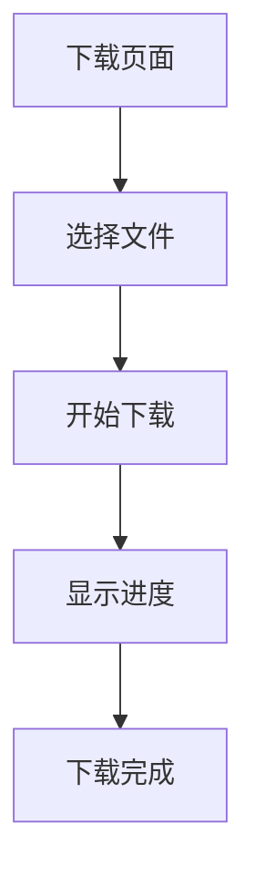

## 1. 产品概述
FlareDrive-R2简化版下载工具 - 专注于文件下载功能，移除所有非下载相关信息和界面。

## 2. 核心功能

### 2.1 用户角色
| 角色 | 注册方式 | 核心权限 |
|------|----------|----------|
| 访客用户 | 无需注册 | 文件下载 |

### 2.2 功能模块
下载工具仅包含以下核心页面：
1. **下载页面**: 文件下载区域、下载进度显示

### 2.3 页面详情
| 页面名称 | 模块名称 | 功能描述 |
|----------|----------|----------|
| 下载页面 | 文件下载区 | 显示可下载文件列表，支持点击下载 |
| 下载页面 | 下载进度 | 显示当前下载进度和状态 |
| 下载页面 | 下载管理 | 显示下载历史和管理下载任务 |

## 3. 核心流程
用户操作流程：
1. 用户访问下载页面
2. 查看可下载文件列表
3. 点击文件开始下载
4. 查看下载进度
5. 下载完成后文件保存到本地

## 4. 用户界面设计

### 4.1 设计风格
- 主色调：蓝色 (#2563eb)
- 按钮样式：圆角矩形
- 字体：系统默认字体
- 布局风格：简洁卡片式布局
- 图标风格：简约线条图标

### 4.2 页面设计概览
| 页面名称 | 模块名称 | UI元素 |
|----------|----------|--------|
| 下载页面 | 文件下载区 | 简洁的文件列表，每个文件显示名称和下载按钮 |
| 下载页面 | 下载进度 | 进度条显示，包含百分比和剩余时间 |
| 下载页面 | 下载管理 | 下载任务列表，可暂停/继续/取消下载 |

### 4.3 响应式设计
桌面优先设计，支持移动端自适应，触摸交互优化。