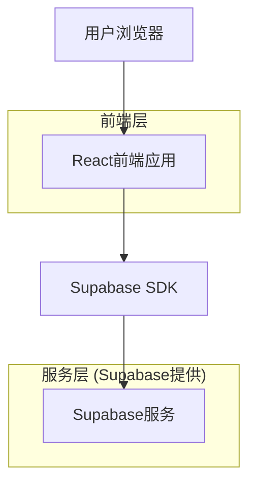
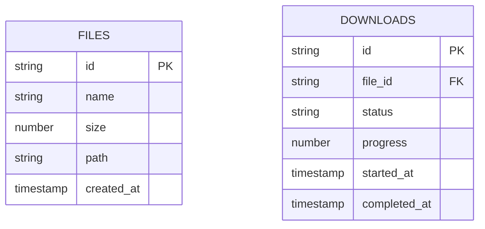

## 1. 架构设计



## 2. 技术栈描述

- 前端: React@18 + tailwindcss@3 + vite
- 初始化工具: vite-init
- 后端: Supabase (提供文件存储和下载服务)
- 文件存储: Supabase存储桶

## 3. 路由定义

| 路由 | 用途 |
|-------|---------|
| / | 下载页面，显示文件列表和下载功能 |
| /download/:fileId | 文件下载页面，显示下载进度 |

## 4. API定义

### 4.1 文件下载相关API

获取文件列表
```
GET /api/files
```

响应:
| 参数名 | 参数类型 | 描述 |
|-----------|-------------|-------------|
| files | array | 文件列表 |
| id | string | 文件ID |
| name | string | 文件名 |
| size | number | 文件大小 |

示例
```json
{
  "files": [
    {
      "id": "file-123",
      "name": "example.zip",
      "size": 1048576
    }
  ]
}
```

获取文件下载链接
```
POST /api/files/download
```

请求:
| 参数名 | 参数类型 | 是否必需 | 描述 |
|-----------|-------------|-------------|-------------|
| fileId | string | true | 文件ID |

响应:
| 参数名 | 参数类型 | 描述 |
|-----------|-------------|-------------|
| downloadUrl | string | 文件下载链接 |
| expiresAt | string | 链接过期时间 |

## 5. 数据模型

### 5.1 数据模型定义



### 5.2 数据定义语言

文件表 (files)
```sql
-- 创建文件表
CREATE TABLE files (
    id UUID PRIMARY KEY DEFAULT gen_random_uuid(),
    name VARCHAR(255) NOT NULL,
    size BIGINT NOT NULL,
    path TEXT NOT NULL,
    created_at TIMESTAMP WITH TIME ZONE DEFAULT NOW()
);

-- 创建下载记录表
CREATE TABLE downloads (
    id UUID PRIMARY KEY DEFAULT gen_random_uuid(),
    file_id UUID REFERENCES files(id),
    status VARCHAR(20) DEFAULT 'pending' CHECK (status IN ('pending', 'downloading', 'completed', 'failed')),
    progress INTEGER DEFAULT 0 CHECK (progress >= 0 AND progress <= 100),
    started_at TIMESTAMP WITH TIME ZONE DEFAULT NOW(),
    completed_at TIMESTAMP WITH TIME ZONE
);

-- 创建索引
CREATE INDEX idx_files_created_at ON files(created_at DESC);
CREATE INDEX idx_downloads_file_id ON downloads(file_id);
CREATE INDEX idx_downloads_status ON downloads(status);

-- 授权访问权限
GRANT SELECT ON files TO anon;
GRANT SELECT ON downloads TO anon;
GRANT ALL PRIVILEGES ON files TO authenticated;
GRANT ALL PRIVILEGES ON downloads TO authenticated;
```